# SIT725 Bartering System 🥬🐶

<h2>Table of Contents</h2>
<ol>
  <li><a href="#introduction">Introduction</a></li>
  <li>
    <a href="#run-the-project-via-command-line">Run the project via command line</a>
    <ol>
      <li><a href="#clone-this-repository">Clone this repository</a></li>
      <li><a href="#install-dependency">Install dependency</a></li>
      <li><a href="#start-project">Start project</a></li>
    </ol>
  </li>
    
  <li>
    <a href="#run-the-project-via-docker">Run the project via Docker</a>
    <ol>
        <li><a href="#pull-the-image">Pull the image</a></li>
        <li><a href="#run-the-container">Run the container</a></li>
    </ol>   
  </li>
  <li>
    <a href="#documentations">Documentations</a>
    <ol>
      <li><a href="#register">Register</a></li>
      <li><a href="#login">Login</a></li>
      <li><a href="#notification">Welcome Message</a></li>
      <li><a href="#upload">Upload a Product</a></li>
      <li><a href="#feedback">Feedback</a></li>
      <li><a href="#filter">Filter</a></li>
      <li><a href="#favorite">Favorite</a></li>
      <li><a href="#transaction">Transaction</a></li>
      <li><a href="#admin">Admin</a></li>
    </ol>
  </li>
  <li>
    <a href="#for-developers">For developers</a>
    <ol>
      <li><a href="#step-1-make-sure-the-project-is-cloned-and-installed">Step 1: Make sure the project is cloned and installed</a></li>
      <li><a href="#step-2-create-feature-branch">Step 2: Create feature branch</a></li>
      <li><a href="#step-3-pull-requests">Step 3: Pull Requests</a></li>
      <li><a href="#step-3-testing">Testing</a></li>
    </ol>
  </li>
  <li>
    <a href="#resources">Resources</a>
    <ol>
      <li><a href="#git-branching-model">Git branching model</a></li>
    </ol>
  </li>
</ol>
<br><br>
<h2 id='introduction'> Introduction </h1>


Batering system finds your precious used items a new owner! Simply upload any valuable goods, and we will guarantee the best trade you can get

<h2 id="documentations">Documentations</h2>

<h3 id="register">Register</h3>

**Create a new account**
- At the home page, click the **Register** button to create a new account.
- User has to input the email, name and password to complete the register.
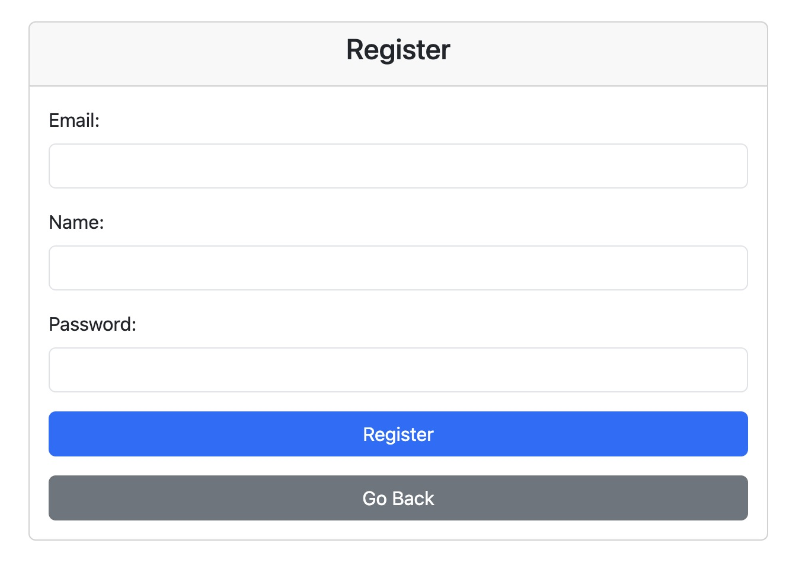

<h3 id="login">Login</h3>

**Login your account**
- At the home page, user has to input the email and password collectly to login the account.
- Click the **Login** button.
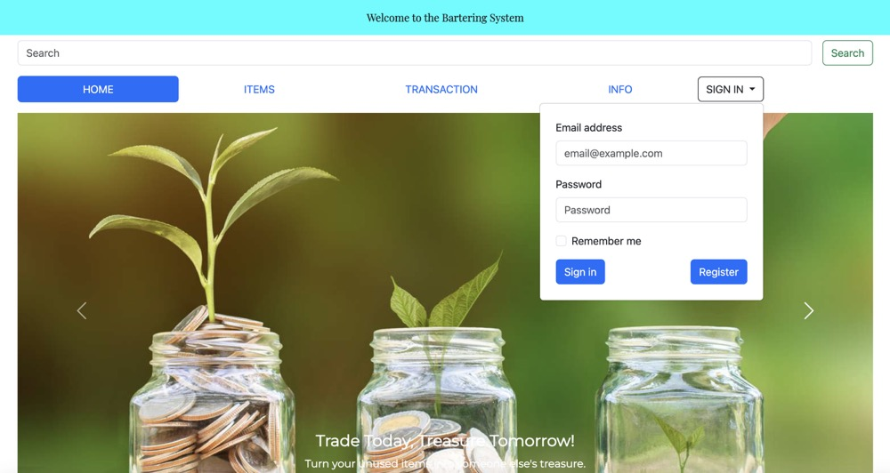

<h3 id="notification">Welcome Message</h3>

**Welcome Message**
- When the user login into the website, a welcome message will be displayed at the top of the website.
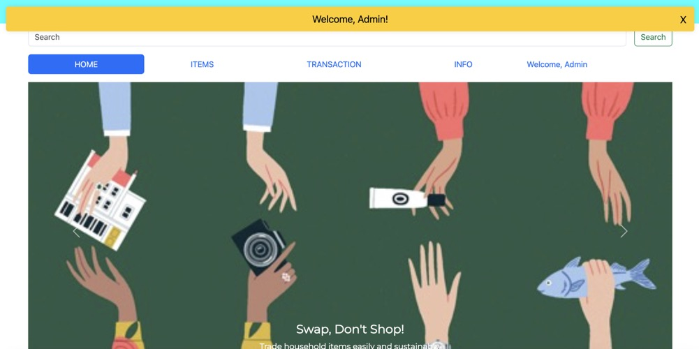

<h3 id="upload">Upload a Product</h3>

**Upload a product**
- At the profile page, user can click the **Uploadt** button to upload a product.
- User has to input the product name, product image, product price and description information.
- All the products which user has uploaded will be displayed at user profile page.

- When the product has been uploaded successful, a notification will be displayed at the top of the website.
- All the products which user has uploaded will be displayed at user profile page.
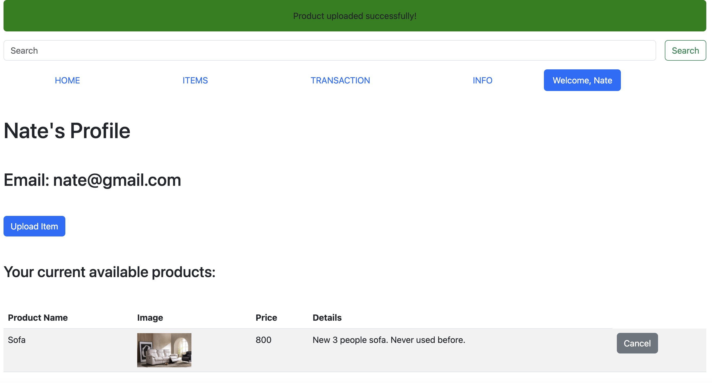

**Cancel a product**
- When user wants to cancel the product, he can click the **Cancel** button to cancel.
- After clicking the **Cancel** button, a notificaiton will be displayed at the top of the website.
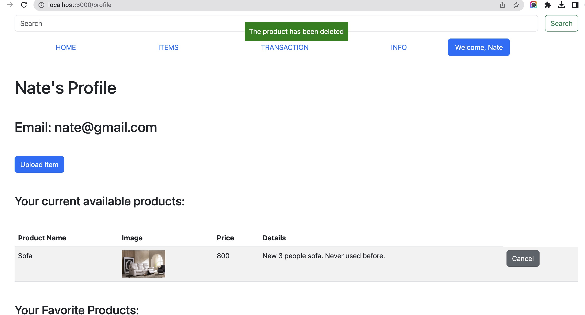

<h3 id="feedback">Feedback</h3>

**Send a feedback**
- At the info page, user can send the feedback about this website.
- User has to input their email, name, phone number and message, then click the **Send** button to send the feedback.
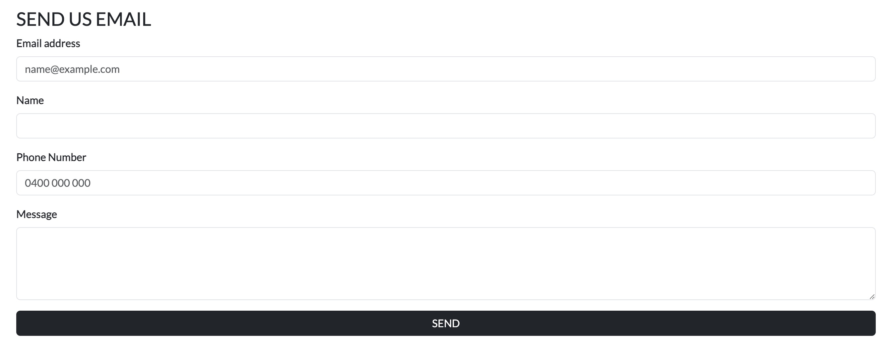

<h3 id="filter">Filter</h3>

**Filter the products**
- At the item page, user can select the price range to find the product more easily.


<h3 id="favorite">Favorite</h3>

**Add to Favorite**
- At the product detail page, user can click the **Add to Favorites** button to add this product to their favorites.
- After clicking this button, there is a pop-up window to display the successful message.
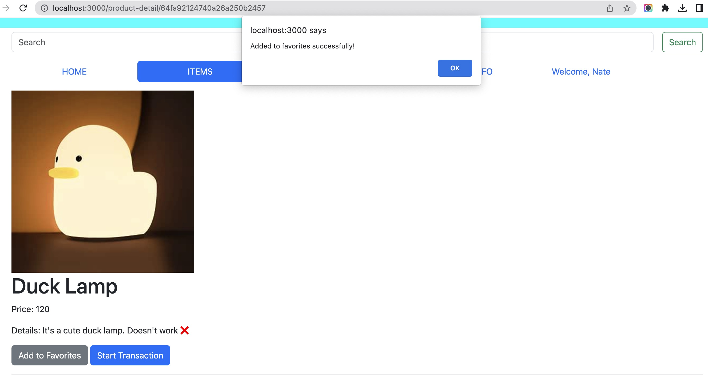

**Find the Favorites**
- At the profile page, user can find all 'favorites' products.
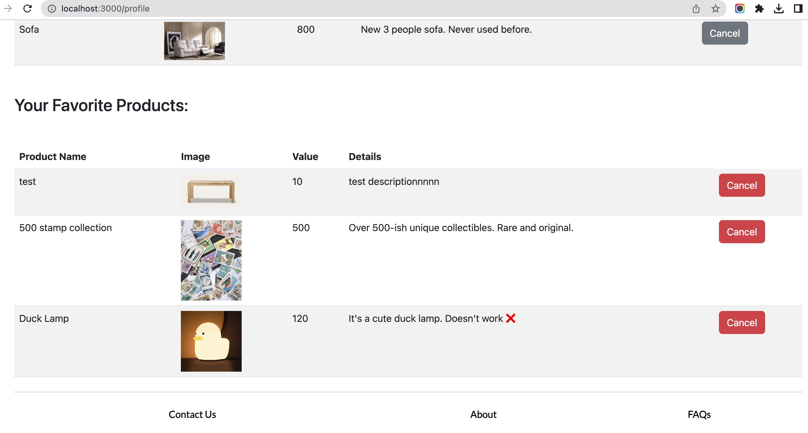

**Cancel the Favorites**
- Click the **Cancel** button, user can remove the products from their 'favorites'.
- There is a notification at the top of the website to display the remove message.


<h3 id="transation">Transaction</h3>

**Creating a new transaction**
- In the item tab, select an item you wish to barter
- Click on the item to view details. At the bottom, **Start Transaction** button will appear
- On click, user will be prompt with a list of their own items. User can select an item to start bartering
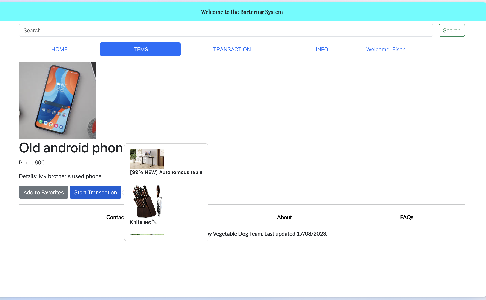

**View transactions list**
- Select the **transaction** tab in navbar. User will be redirected to the transaction page
- Here, user can view all past and current transaction on the left panel
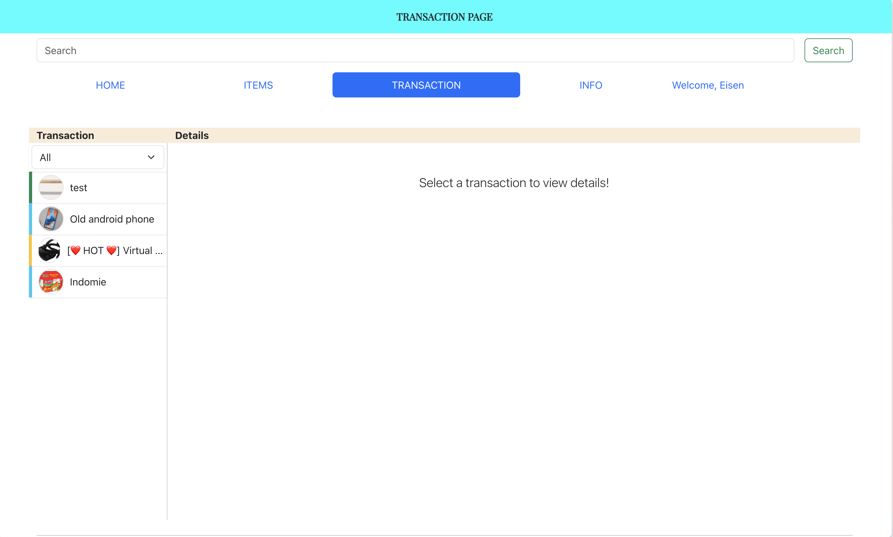

**Filter transactions list**
- On the top of the left panel, a dropdown is available to filter transaction by status. 

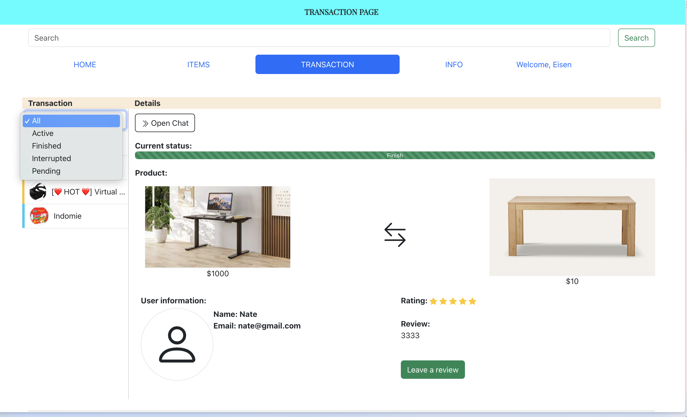

- A transaction can have 4 type of statuses:
  - **Active**: Transaction is currently in progress
  - **Pending**: Transaction has been marked as finish by 1 user. The other user must also mark as finish to continue
  - **Finished**: Transaction has been marked as finished by both user. 
  - **Interrupted**: Transaction has been marked as canceled by 1 user; alternatively, one of the products in this transaction has become unavailable.

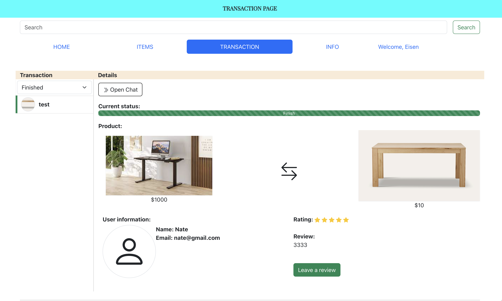

**View transactions details**
- User can select any transaction from the left panel, which will display that transaction's details: current status of the transaction, item details, barterer information, and transaction actions
- On the top-left corner, a **View Chat** button will also appear.
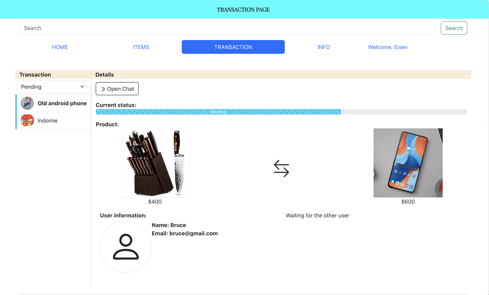

**Start chatting**
- User can click on the **View Chat** button to start messaging other user. This is a two-way real-time chat supported by socket.io


**Cancel Transaction**
- In transaction detail view, user can press **Cancel** button to disrupt transaction. 
- This is irriversible, therefore a confirmation prompt for confirmation is displayed
- On confirm, the transaction will be interrupted
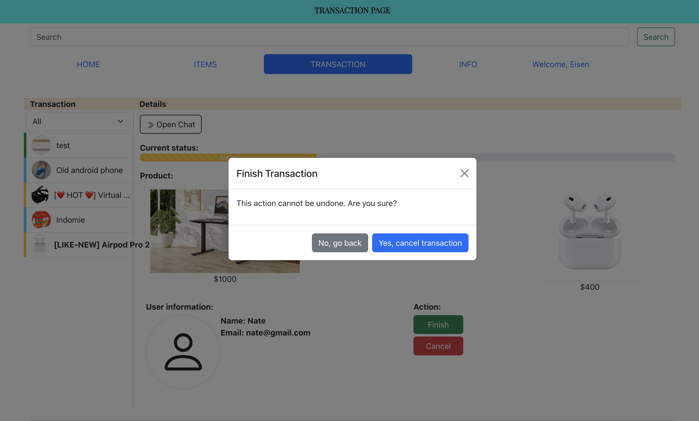

**Review and Rating  post-transaction**

<h3 id="admin">Admin</h3>

**Admin page**
- Our website has an admin account, when we login this account, the profile will display the admin panel.
- We can manage the user, product and feedback.
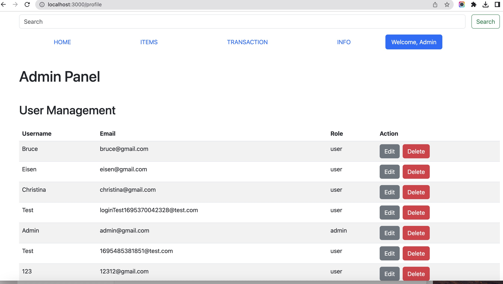

**Edit user and product**
- If we click the **Edit** button, we can edit the user or product information.
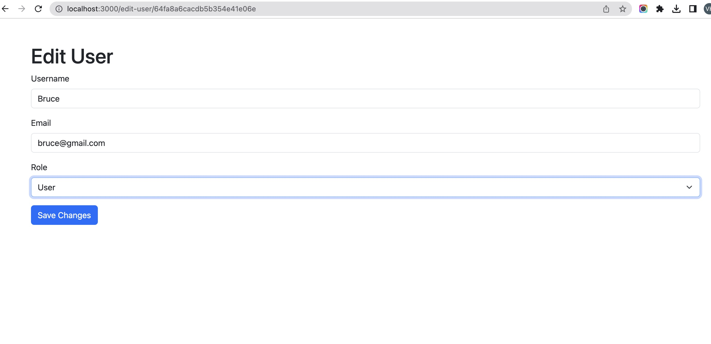

**Delete user, product and feedback**
- If we click the **Delete** button, we can delete the user or product or feedback.
- There is a delete successful notification after clicking the button.
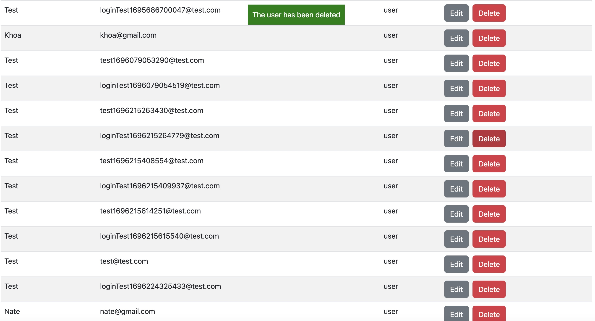

<h2 id="run-the-project-via-command-line">Run the project via command line</h2>

<h3 id="clone-this-repository">Clone this repository</h3>

```
git clone https://github.com/anhkhoado932/BarteringSystem.git
```

<h3 id="install-dependency">Install dependency</h3>

```
npm install
```

<h3 id="start-project">Start project</h3>

```
npm start
```

<h2 id="run-the-project-via-docker">Run the project via Docker</h2>
<h3 id="pull-the-image">Pull the image</h2>

```
docker pull ghcr.io/anhkhoado932/barteringsystem:latest
```

<h3 id="run-the-container">Run the container</h2>

```
docker run -d -p 3000:3000 ghcr.io/anhkhoado932/barteringsystem:latest

```
<h2 id="for-developers">For developers</h2>

<h3 id="step-1-make-sure-the-project-is-cloned-and-installed">Step 1: Make sure the project is cloned and installed</h3>

-   Checkout to the **latest** `main` branch

```
git checkout main
git pull
```

<h3 id="step-2-create-feature-branch">Step 2: Create feature branch</h3>
Create branch name corresponding to the trello card. Example are shown below:
<table>
<tr>
    <td><b>Trello card</b></td>
    <td><b>Branch name</b></td>
</tr>

<tr>
    <td>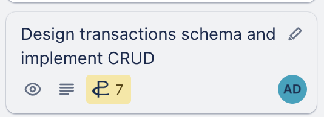</td>
    <td><code>feature/design-transactions-schema-and-implement-crud</code></td>
</tr>
<tr>
    <td>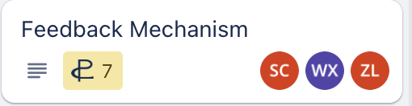</td>
    <td><code>feature/feedback-mechanism</code></td>
</tr></table>

```
git branch <branch-name>
git checkout <branch-name>
```

<h3 id="step-3-pull-requests">Pull requests</h3>

- After you have **finished** the task, go to Github and create a pull request
- **Don't** work on the branch after it has been merged.

<h3 id="step-4-testing">Testing</h3>

Run unit tests
```
npm test
```

Run end to end test (headless)
```
npm run test:e2e
```

Run end to end test (within browser)
```
npm run cypress:open
```
## Resources

-   [Git branching model](https://nvie.com/posts/a-successful-git-branching-model/)
